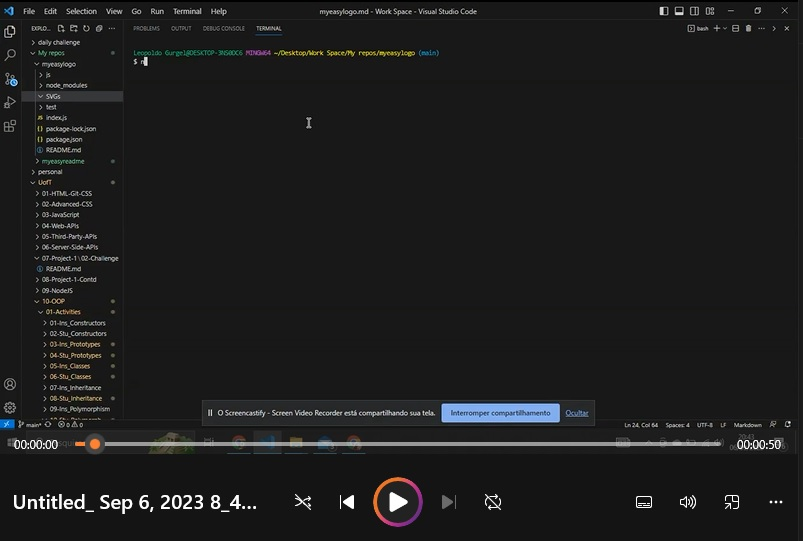

# My Easy Logo

## DESCRIPTION
My Easy Logo is a powerfull tool that will easily generate a logotype for your project. All you have to do is answer a few questions on your command-line and that's it. You have your logo and you saved time and money. Looks like witchcraft, right?

Watch the video and see the magic happen!

## TABLE OF CONTENTS
* [Installation](#installation)
* [Usage](#instructions)
* [Contributing](#contribution)
* [License](#license)
* [Contact](#contact)

## INSTALLATION
1 - Make sure you have Node.js installed on your computer. If you don't, download it from https://nodejs.org and install it.  
2 - On your command line (we recommend Bash), open the repo folder.  
3 - Clone this repo into an existing folder on your computer.  
4 - To install the needed node packages to run this app, on your command line, run: <   npm i   >  
  
And that was it. You have everything you need to start creating logos like a wizard.

## USAGE
1 - Open the folder containing this app on your command line (we recommend Bash)  
2 - Run node index.js  
3 - The questions will render on your console. Answer them until you get a message confirming that your file was created.  
4 - To find the file, got to the markdowns folder.  
5 - It is named after your project by default. We recommend you to rename it to README.md when you paste it on your project repo.

## CONTRIBUTING
You are welcome to help if you have any ideas to improve our project! If you want to do so, just follow these steps:

1 - Fork the repository.  
2 - Create a new branch for you new feature or bug fix.  
3 - Make the changes you have in mind.  
4 - Commit your changes and push them to your fork.  
5 - Open a pull request detailing the changes you've made.

## LICENSE
MIT license

# CONTACT
* Github: [LeopoldoGurgel](https://github.com/LeopoldoGurgel)
* E-mail: leopoldogbp@gmail.com

This file was generated by Easy Readme Generator